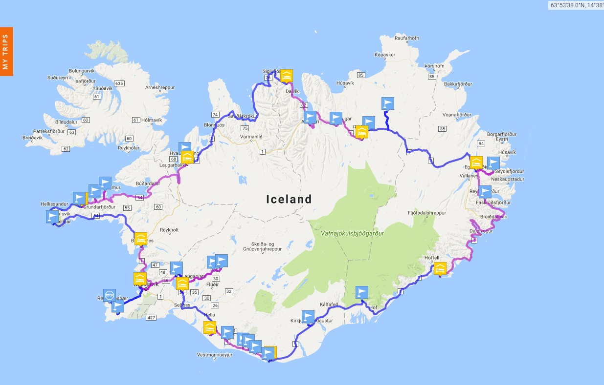

The Land of Fire & Ice
========================================================
author: Joseph Walker
date: February 16, 2017
autosize: TRUE
transition: fade
transition-speed: default

Why Iceland?
========================================================
* Cheap flights with Wow Airlines
* Safe/Tourist Friendly
* Geographically Diverse

***

* 4198 miles
* 9 hours

Trip Stats
===
 Counter clock-wise road trip the island via Route 1 (widely known as The Ring Road)
* 12 days 
* 1385 miles
* 31 hours of driving
* Countless roundabouts

Expense Analysis
===

Total Spent: $5907

Let's Have A Look
===
type: prompt

[photos!](https://goo.gl/photos/A8JzxR58cEMPXU2d9)
